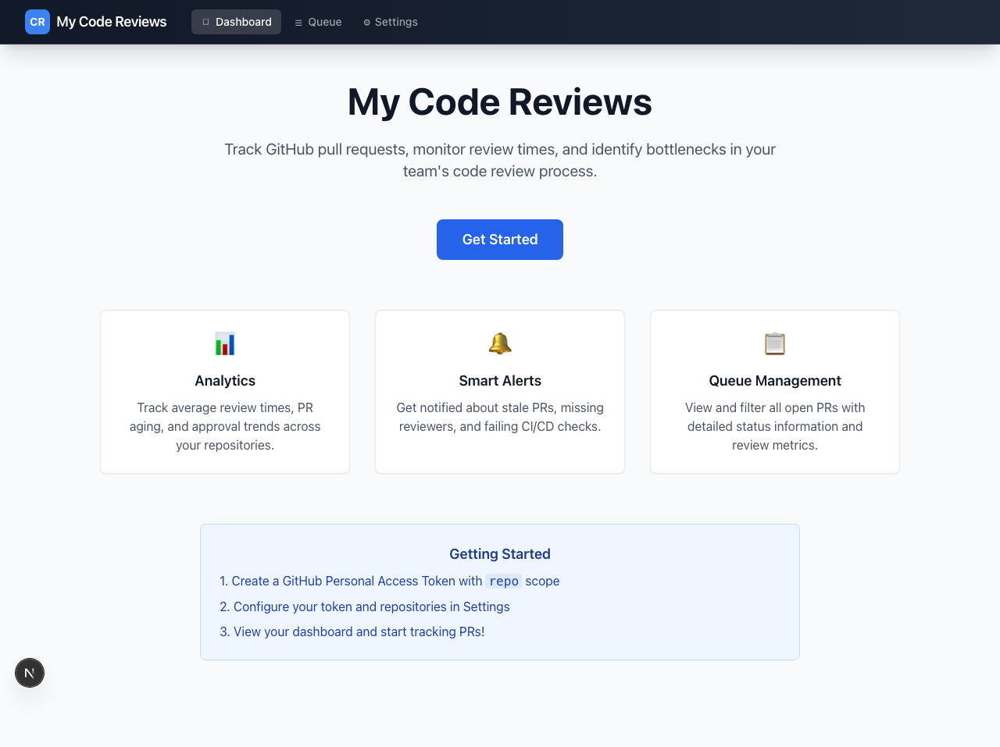

# My Workspace

A developer hub built with Next.js that brings GitHub PR tracking, a personal calendar, and Hacker News into a single dashboard.



## Features

### 📊 PR Tracking & Analytics
- **PR Queue**: View all open PRs in a sortable, filterable table
- **Average Review Time**: Track time from PR creation to first review, broken down by repository
- **Review Load**: See how many PRs each team member is assigned to review
- **Approval Trends**: Track approval times over the past 30 days

### 🔔 Smart Alerts
Automatically identify problematic PRs:
- **Stale PRs**: Open for more than 3 days
- **No Reviewers**: PRs without assigned reviewers
- **Failing CI**: PRs with failing CI/CD checks
- **Changes Requested**: PRs with unaddressed change requests

### 📅 Calendar Manager
- Monthly calendar grid with intuitive navigation
- Create events with title, time, and color coding
- View and delete events per day
- Events persist in browser localStorage
- Upcoming events widget on the dashboard

### 📰 Hacker News Feed
- Browse Top, New, and Best stories from Hacker News
- Story cards with score, author, time, and comment count
- Links to original articles and HN discussion threads
- Auto-refreshes every 5 minutes
- Top 5 stories widget on the dashboard

### 📋 Queue Management
- Sortable columns (age, author, repository, title, comments)
- Filters for repository, author, and reviewer
- Visual indicators for review status and alerts
- Click any row to open the PR in GitHub

## Tech Stack

- **Framework**: Next.js 15 (App Router)
- **Language**: TypeScript
- **Styling**: Tailwind CSS
- **GitHub API**: Octokit REST client
- **Data Fetching**: SWR for caching and revalidation
- **Charts**: Recharts
- **Date Utilities**: date-fns
- **Testing**: Jest + Testing Library (62 tests)

## Getting Started

### Prerequisites

- Node.js 18+ and npm
- A GitHub account (for PR features)
- GitHub Personal Access Token (for PR features)

### Installation

1. **Clone the repository**
   ```bash
   git clone <repository-url>
   cd claude-box
   ```

2. **Install dependencies**
   ```bash
   npm install
   ```

3. **Run the development server**
   ```bash
   npm run dev
   ```

4. **Open your browser**
   Navigate to [http://localhost:3000](http://localhost:3000)

> **Note**: The Calendar and Hacker News features work immediately with no configuration. GitHub PR features require a Personal Access Token (see below).

### GitHub Personal Access Token

1. Go to [GitHub Settings > Developer settings > Personal access tokens > Tokens (classic)](https://github.com/settings/tokens/new)
2. Click "Generate new token (classic)"
3. Give it a descriptive name (e.g., "My Workspace")
4. Select the following scope:
   - **repo** (Full control of private repositories)
5. Click "Generate token"
6. **Copy the token immediately** (you won't be able to see it again)

### Configuration

1. Navigate to the **Settings** page
2. Paste your GitHub Personal Access Token
3. Click "Test Connection" to verify the token works
4. Add repositories in the format `owner/repository` (e.g., `facebook/react`, `microsoft/vscode`)
5. Click "Save & Continue"

## Usage

### Dashboard

The main dashboard displays a 2x2 grid:
- **Top left**: Hacker News top stories
- **Top right**: PR metrics (Open PRs, Repositories, Alerts breakdown)
- **Bottom left**: PR Queue (oldest PRs sorted by age)
- **Bottom right**: Upcoming calendar events

### Calendar

- Click any day to add an event
- Click a day with events to view or delete them
- Navigate months with arrow buttons or jump to today
- Choose from 6 event colors for visual organization

### News

- Switch between Top, New, and Best story feeds
- Each story shows rank, title, domain, score, author, and comment count
- Click stories to read the article or visit the HN discussion

### Queue Page

Comprehensive view of all open PRs with:
- Sortable columns (age, author, repository, title, comments)
- Filters for repository, author, and reviewer
- Visual indicators for review status and alerts

### Settings

- Update your GitHub token
- Add or remove repositories
- Test connection to verify authentication
- Sign out to clear stored credentials

## Security Considerations

**Important Notes**:

- Your GitHub token is stored in **browser localStorage**
- Calendar events are also stored in browser localStorage
- This is suitable for personal use or demo purposes
- For production use with multiple users, consider:
  - Server-side session storage
  - Encrypted httpOnly cookies
  - OAuth flow with GitHub App

### Token Permissions

- **repo** scope (read-only access to repositories)
- Create a dedicated token for this application
- Regularly rotate your tokens

## Project Structure

```
claude-box/
├── app/                      # Next.js app directory
│   ├── api/                  # API routes
│   │   ├── github/           # GitHub API endpoints (prs, reviews, stats)
│   │   └── hn/               # Hacker News API proxy
│   ├── calendar/             # Calendar page
│   ├── news/                 # Hacker News page
│   ├── queue/                # Queue page
│   ├── settings/             # Settings page
│   ├── layout.tsx            # Root layout
│   ├── page.tsx              # Home / Dashboard
│   └── globals.css           # Global styles
├── components/               # React components
│   ├── analytics/            # Analytics charts
│   ├── alerts/               # Alert components
│   ├── filters/              # Filter components
│   ├── Navigation.tsx
│   ├── PRCard.tsx
│   ├── PRList.tsx
│   └── PRTable.tsx
├── hooks/                    # Custom React hooks
│   ├── useGithubAuth.ts
│   ├── usePRs.ts
│   ├── useAnalytics.ts
│   └── useHackerNews.ts
├── lib/                      # Core library
│   ├── analytics.ts          # Analytics calculations
│   ├── calendar-storage.ts   # Calendar localStorage CRUD
│   ├── github-api.ts         # GitHub API wrappers
│   ├── github-client.ts      # Octokit client setup
│   ├── hn.ts                 # Hacker News API client
│   ├── storage.ts            # Config localStorage helpers
│   └── types.ts              # TypeScript types
├── __tests__/                # Test suite (62 tests)
│   ├── helpers.ts            # Test fixtures
│   ├── analytics.test.ts
│   ├── storage.test.ts
│   ├── calendar-storage.test.ts
│   └── hn-api.test.ts
└── public/                   # Static assets
```

## Development

### Running Locally

```bash
npm run dev
```

Open [http://localhost:3000](http://localhost:3000) in your browser.

### Building for Production

```bash
npm run build
npm start
```

### Testing

```bash
npm test             # Run all 62 tests
npm run test:watch   # Run tests in watch mode
```

### Linting

```bash
npm run lint
```

## Deployment

### Deploy to Vercel (Recommended)

1. Push your code to a GitHub repository
2. Import the project in [Vercel](https://vercel.com)
3. Vercel will automatically detect Next.js and deploy
4. No environment variables needed (client-side storage)

[](https://vercel.com/new)

### Deploy to Other Platforms

This app can be deployed to any platform that supports Next.js:
- Netlify
- AWS Amplify
- Cloudflare Pages
- Railway
- Render

## API Reference

### POST /api/github/prs

Fetch all open PRs with enriched metrics.

**Request Body:**
```json
{
  "token": "ghp_xxxxx",
  "repositories": [
    { "owner": "facebook", "name": "react", "fullName": "facebook/react" }
  ]
}
```

**Response:**
```json
{
  "prs": [
    {
      "id": 123,
      "number": 456,
      "title": "Fix bug in component",
      "ageInDays": 2,
      "reviewStatus": "pending",
      "alerts": ["stale"]
    }
  ]
}
```

### POST /api/github/stats

Calculate analytics and statistics.

**Response:**
```json
{
  "stats": {
    "averageReviewTimeHours": 24.5,
    "totalOpenPRs": 42,
    "totalAlerts": 8
  }
}
```

### GET /api/hn

Fetch Hacker News stories.

**Query Parameters:**
- `type` — `top` | `new` | `best` (default: `top`)
- `limit` — number of stories, max 50 (default: `30`)

**Response:**
```json
{
  "stories": [
    {
      "id": 12345,
      "title": "Show HN: My new project",
      "url": "https://example.com",
      "by": "username",
      "score": 142,
      "time": 1708099200,
      "descendants": 45,
      "type": "story"
    }
  ]
}
```

## Troubleshooting

### Token Issues

**Problem**: "Invalid token" error
- Verify you copied the entire token
- Ensure the token has `repo` scope
- Check if the token has expired

### API Rate Limits

**Problem**: Getting rate limit errors
- GitHub allows 5,000 requests/hour for authenticated users
- SWR caching reduces requests significantly
- Refresh intervals: PRs (60s), Stats (120s)

### No PRs Showing

**Problem**: Dashboard shows 0 PRs
- Verify repositories are spelled correctly (`owner/repo`)
- Check that repositories have open pull requests
- Ensure your token has access to the repositories

## Contributing

Contributions are welcome! Please feel free to submit a Pull Request.

1. Fork the repository
2. Create your feature branch (`git checkout -b feature/AmazingFeature`)
3. Commit your changes (`git commit -m 'Add some AmazingFeature'`)
4. Push to the branch (`git push origin feature/AmazingFeature`)
5. Open a Pull Request

## License

This project is licensed under the MIT License.

## Acknowledgments

- [Next.js](https://nextjs.org/) - React framework
- [Tailwind CSS](https://tailwindcss.com/) - Utility-first CSS
- [Octokit](https://github.com/octokit/rest.js) - GitHub REST API client
- [SWR](https://swr.vercel.app/) - Data fetching library
- [Recharts](https://recharts.org/) - Charting library
- [date-fns](https://date-fns.org/) - Date utility library
- [Hacker News API](https://github.com/HackerNews/API) - Public Firebase API

---

**Built with Next.js, Tailwind CSS, and the Hacker News API**
